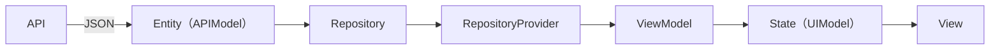

# 設計

## 1章: アーキテクチャ

- このアプリは MVVMアーキテクチャを参考に以下のパイプラインに沿って構築しています。

各要素の本リポジトリでの役割：

- Entity（`lib/models/...`）
  - 外部 API から取得したデータ構造をそのまま表現するクラス群です。
  - 本プロジェクトでは階層構造はそのまま、必要なデータのみを扱っています。
  - freezed / json_serializable で JSON の入出力に対応しています。

- Repository（`lib/repositories/...`）
  - API を叩いて `Entity` を取得します。

- RepositoryProvider（`..._provider.dart`）
  - Riverpod のプロバイダを使って Repository インスタンスを組み立て・提供するファイルです。
  - ここで HTTP クライアント（`dioClientProvider`）などの依存を注入します。
  - テスト時はこの Provider を差し替えてモック実装を渡す運用を想定しています。

- ViewModel（`lib/view_models/...`）
  - View に必要な形にデータを加工し、UI の状態（State）を制御します。

- State（`lib/models/..._state.dart` など）
  - View が直接使うデータ構造です。

- View（`lib/views/...`）
  - 実際に描画を行う Widget。View は ViewModelから公開された State を監視して描画を行います。

### 設計の意図
- 1週間という期間が短いことを考慮し、以前少しだけ使ってみたことがあったMVVMアーキテクチャを採用しました。
- API から返ってくるデータとView が必要とするデータは異なることが多いので、「APIモデル」と「UIモデル」を明示的に分けました。

---

## 2章: ページ別ファイル構成
各ページを構成する主要ファイルを一覧化

### Search（検索ページ）

- View
  - `lib/views/search/search_page.dart` — 検索画面のルート Widget（検索ボックスとリストを含む）
  - `lib/views/search/repo_list_view.dart` — リポジトリ一覧表示の Widget

- ViewModel
  - `lib/view_models/search/search_page_view_model.dart` - 検索画面の ViewModel 検索ワードの保持と提供
  - `lib/view_models/search/repo_list_view_model.dart` — リストの状態管理（読み込み、リフレッシュ、エラー）
  - `lib/view_models/search/repo_to_state_mapper.dart` — Entity -> State のマッピング補助

- Model
  - `lib/models/search/repo_list_entity.dart` — リポジトリのリストを表すエンティティ
  - `lib/models/search/repo_entity.dart` — リポジトリ1つ分のデータを表すエンティティ
  - `lib/models/search/repo_owner_entity.dart` — オーナー情報を表すエンティティ

- Repository
  - `lib/repositories/github/search/repo_search_repository.dart`- GitHubリポジトリを検索するリポジトリ
  - `lib/repositories/github/search/repo_search_repository_provider.dart` - DI 用 Provider
### Detail（リポジトリ詳細）

- View
  - `lib/views/detail/detail_page.dart` — 詳細画面のルート
  - `lib/views/detail/repo_detail_view.dart` — 詳細画面のbodyとなるview

- Model
  - `lib/models/detail/repo_detail_state.dart` — 詳細データ／UI 状態

### Login（ログイン / アバター）

- View
  - `lib/views/login/login_avatar_view.dart` — タップしたらログインできるView

- ViewModel
  - `lib/view_models/login/login_avatar_view_model.dart` — ログイン状態、プロフィール取得、トークン保存の処理を担当

- Models / Entities
  - `lib/models/login/user_profile_entity.dart` — ユーザープロファイルの Entity
  - `lib/models/login/login_state.dart` — ログイン状態を表す State

- Repository
  - `lib/repositories/github/login/oauth_repository.dart` — OAuth ログインを扱う Repository
  - `lib/repositories/github/login/oauth_repository_provider.dart` DI 用 Provider

### 共通ユーティリティ／コア層
- `lib/core/data/dio_client.dart`, `lib/core/data/dio_client_provider.dart` — Dio クライアントのラッパー
- `lib/core/data/api_exception.dart` — API 例外の定義
  - DioExceptionでは過剰＆リクエスト超過時のエラーを独立させたいという意図で自作のExceptionを作成
- `lib/core/storage/token_storage_provider.dart` — トークン保存／取得の Provider