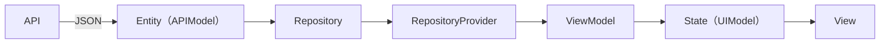

# Yumemi Codecheck
株式会社ゆめみ様Flutter エンジニアコードチェック課題

## 開発環境
- Flutter: 3.35.5
- Dart SDK version: 3.9.2

## 伝達事項
- このプロジェクトでは、GitHub OAuth 認証に必要なクライアント情報などを.env ファイルで管理しています。お手数ですが、.env.exampleを参考にルートディレクトリ直下に .envファイルを作成し、必要な値の設定をお願いします。
- 実装前の設計やタスクの分割にはfigmaを使用しました。
- .env, figmaのURLをメールにて送信いたしましたので,ご確認いただけますと幸いです。

## 設計
- このアプリは MVVMアーキテクチャを参考に以下のパイプラインに沿って構築しています。

設計の詳細は[ARCHITECTURE.md](https://github.com/kota78/yumemi-codecheck/blob/main/ARCHITECTURE.md)に記載しています。

## 実装した機能
### リポジトリ検索
- 検索ボックスに文字を入力し確定すると、リポジトリ名の一覧が表示される
- riverpod_paging_utilsを使用
	- リクエストエラー時、標準のviewでは多言語対応が難しかったため、CustomErrorView作成し使用
### リポジトリ情報の詳細表示
- リポジトリ名をタップすると，詳細ページに遷移
	- リポジトリ名、オーナーアイコン、プロジェクト言語、Star 数、Watcher 数、Fork 数、Issue 数を表示
- 戻るボタンを押下すると戻る
### OAuth認証によるログイン機能
- 検索ページ右上のユーザーアイコンを押すことでログインができる
	- ログイン時はログインユーザーの画像に切り替わる
- アクセストークンをヘッダに添付する
	- リクエスト制限が緩和
- アクセストークンは端末に保存し，再起動時に有効なトークンがあればログイン状態を保持
	- flutter_secure_storageを使用
- 環境変数の読み込み
	- flutter_dotenvを使用
	- CI上ではGitHub上でSecretsを定義し.envファイルを作成
### ダークモードへの対応
- 基本は既存のThemeを切り替えることで対応
- 検索ボックス等一部は個別対応
### 多言語対応
- flutter_localizationsを使用
- 英語，日本語に対応

## CI（GitHub Actions）
- `main` ブランチの品質を保つために、GitHub Actions で自動チェックを実行しています。
- Pull Request の作成時と main へのマージ時に以下の処理が走ります：
	- **静的解析（Linter）**（`flutter analyze`）
		- リントルールにはyumemi_lintsを採用
	- **テスト実行**（`flutter test`）
	- **Android Debug ビルド確認**（`flutter build apk --debug`）

## スクリーンショット
[SCREEN_SHOTS.md](https://github.com/kota78/yumemi-codecheck/blob/main/SCREEN_SHOTS.md)
